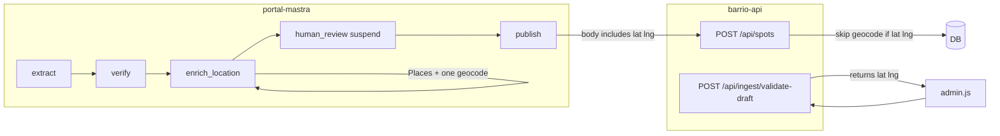

# Ingest: auto-enrich drafts, validate before approve, clearer errors

## Problem (confirmed)

- `[POST /api/spots](server/src/routes/spots.ts)` calls `[geocodeAddress](server/src/services/geocoding.ts)`; vague addresses → **400** with `Could not find location for this address...`.
- `[googlePlacesFetcher](portal-mastra/src/mastra/tools/google-places-fetcher.ts)` already resolves **name + city → `formatted_address`** via Places Text Search + Details, but only if the **extractor agent** uses the tool.
- Admin uses `[resume-async](server/src/admin/ingest/admin.js)`: HTTP returns **before** `publish` runs, so “Approved” can appear even when publish fails later.

## Geocode / Google API deduplication (critical)

Today the stack can hit Google **three times** for the same draft: **enrich** (Places), **validate** (Geocoding), **POST /spots** (Geocoding again inside the route). That wastes quota, money, and latency.

**Rule:** After validate (or enrich) has successfully resolved coordinates, **do not geocode again** on create.

**Implementation:**

1. **Extend** `[createSpotSchema](server/src/schemas/spots.ts)` with **optional** `latitude` and `longitude` (both required together if either is present). If **both** are present and valid numbers, `[POST /spots](/server/src/routes/spots.ts)` **skips** `geocodeAddress` and uses them for `prisma.spot.create`. If **omit**ted, keep current behavior (geocode only from `address`).
2. **Validate endpoint** (`POST /api/ingest/validate-draft`) returns `{ valid: true, latitude, longitude, formattedAddress? }` when geocode succeeds; admin + portal-mastra pass those into **POST /spots** so the route does **not** re-geocode.
3. **portal-mastra** `[publish` / `PortalClient](portal-mastra/src/mastra/lib/portal-client.ts)`: include `latitude` + `longitude` in the JSON when the draft (or enrich step) has them from the same resolution path.
4. **Enrich step** should still prefer Places for **address**; geocode once when computing `publishReady` / coordinates, then **store** lat/lng on the draft so validate and publish reuse them.

**Net:** at most **one** Geocoding call per draft on the happy path (during validate or enrich), and **zero** extra geocode on `POST /spots` when lat/lng are supplied.

## Architecture (target)

## §2 — `POST /api/ingest/validate-draft` (do first)

- New route under `server/src/routes/`, mounted at `/api/ingest` in the main API router (not Mastra proxy).
- **Auth:** `requireAuth`.
- Body: spot/event fields aligned with create schemas.
- **Spot:** run Zod + `geocodeAddress(address)`; response includes `latitude`, `longitude` (and optionally `formattedAddress` from geocode result) for the client to send on create.
- **No Mastra dependency** — standalone, ships first.

## §3 — Admin UI (do second)

- `[server/src/admin/ingest/admin.js](server/src/admin/ingest/admin.js)`: call validate on load/edit; disable Approve until `valid`; on approve, validate again before `resume-async`.
- **Immediate value:** catch bad addresses before any Mastra enrich work.

## §1 — Enrich step (do third)

- New step after `verify` in `[portal-mastra/src/mastra/workflows/ingest.ts](portal-mastra/src/mastra/workflows/ingest.ts)`.
- Deterministic Places + single geocode; populate `address`, `publishReady`, `publishBlockers`, `latitude`/`longitude` on draft when resolved.
- **Extends** `[draft.ts](portal-mastra/src/mastra/schemas/draft.ts)` with optional metadata fields.

## §4 — Publish error clarity (do fourth)

- `publishStep` / `PortalClient`: surface barrio 400 JSON; pass **lat/lng** in body when present so §3 does not re-geocode.

## §5 — Async publish UX

- **Skip §5B (polling)** for now — no post-approve run polling until explicitly requested.
- **§5A** optional: document failed runs in Mastra logs / Railway only.

## Implementation order (explicit)

| Order | Section | Deliverable                                                                                                              |
| ----- | ------- | ------------------------------------------------------------------------------------------------------------------------ |
| 1     | §2      | Validate endpoint + optional `latitude`/`longitude` on `createSpotSchema` + `POST /spots` skip geocode when both present |
| 2     | §3      | Admin wired to validate; gate Approve                                                                                    |
| 3     | §1      | Enrich step; draft fields; portal publish sends lat/lng                                                                  |
| 4     | §4      | Polish errors from API in publish                                                                                        |

**Events:** apply the same “optional lat/lng skip geocode” pattern on `[createEventSchema](server/src/schemas/events.ts)` and `[POST /events](server/src/routes/events.ts)` when you extend validate for events; v1 can ship **spots-only** validate + enrich if you want to narrow scope.

## Testing

- Validate → create with returned lat/lng: **one** geocode call total (validate only).
- Create without lat/lng: geocode only in route (unchanged).

## Files to touch (summary)

| Area         | Files                                                                                                                                                                                                                                                                                                         |
| ------------ | ------------------------------------------------------------------------------------------------------------------------------------------------------------------------------------------------------------------------------------------------------------------------------------------------------------- |
| API + schema | `[server/src/schemas/spots.ts](server/src/schemas/spots.ts)`, `[server/src/routes/spots.ts](server/src/routes/spots.ts)`, new `ingestValidate` route + mount                                                                                                                                                  |
| Admin        | `[server/src/admin/ingest/admin.js](server/src/admin/ingest/admin.js)`                                                                                                                                                                                                                                        |
| Mastra       | `[portal-mastra/src/mastra/workflows/ingest.ts](portal-mastra/src/mastra/workflows/ingest.ts)`, `[portal-mastra/src/mastra/schemas/draft.ts](portal-mastra/src/mastra/schemas/draft.ts)`, `[portal-mastra/src/mastra/lib/portal-client.ts](portal-mastra/src/mastra/lib/portal-client.ts)`, new enrich helper |

